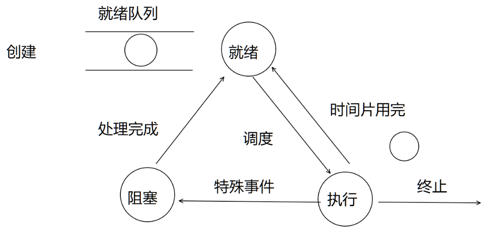
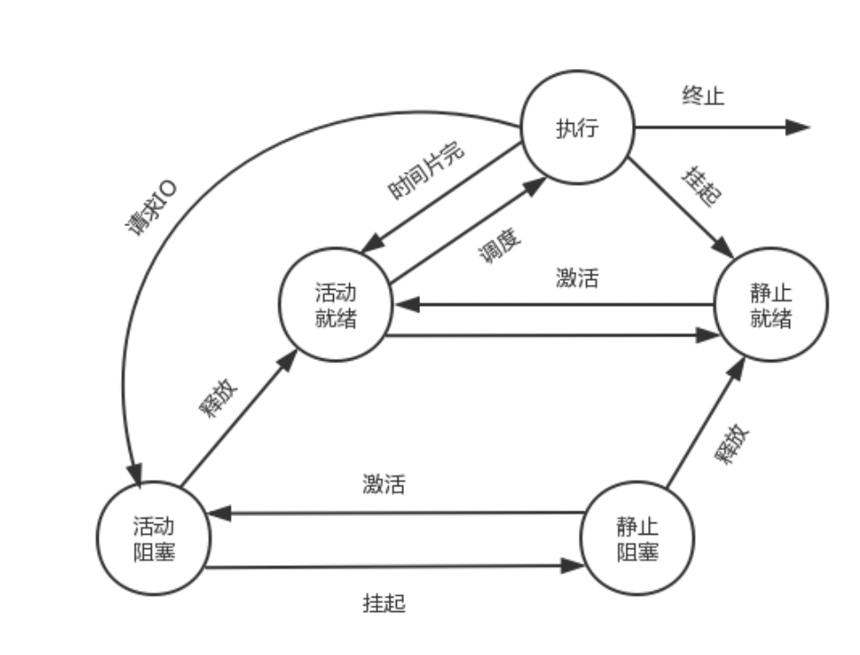
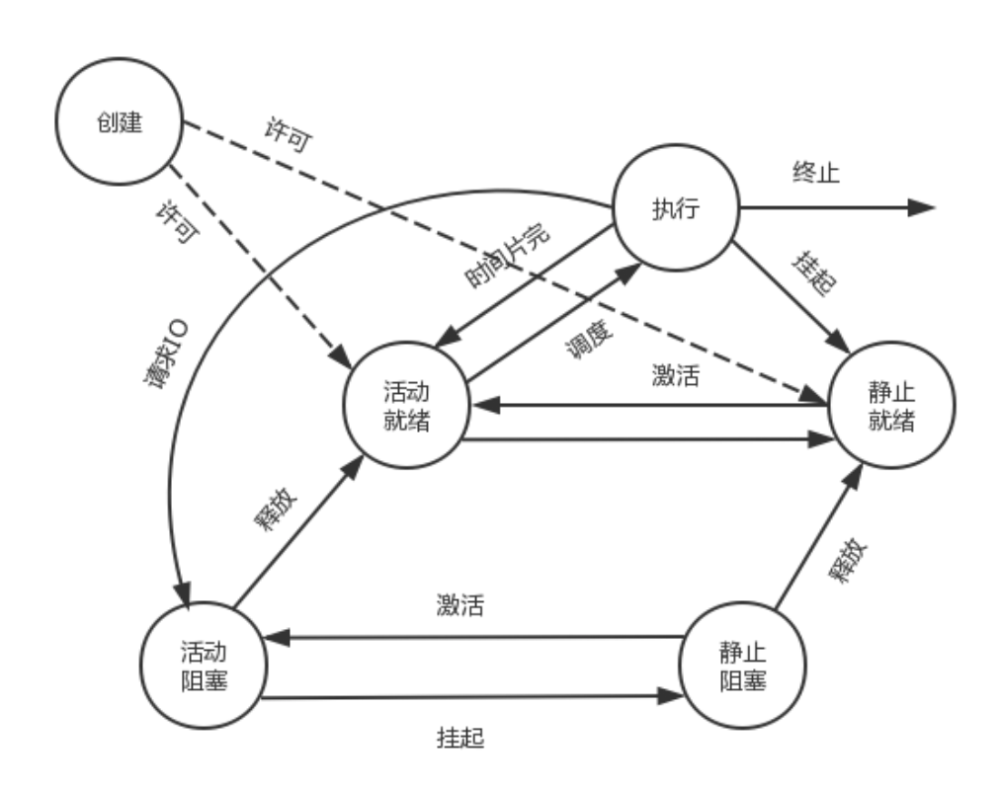

# 进程
## PCB块
为了参与并发的程序能独立运行，操作系统分配专门的数据结构，由操作系统对进程进行管理，PCB是独立数据空间，进程间不共享数据，由系统调度

### PCB结构
#### 进程标识符
+ 外部标识符：方便用户对进程的访问，描述了进程家族关系，父进程标识及子进程标识
+ 内部标识符：通常是进程的序号
#### 处理机状态
+ 通用寄存器：用户程序可以访问的用于暂存信息
+ 指令计数器：存放了要访问下一条指令的地址
+ 程序状态字PSW：含有状态信息
+ 用户栈指针：用于存放过程和系统调用参数及调用地址
#### 进程调度信息
+ 进程状态：进程当前的状态，作为进程调度和对换时的依据
+ 进程优先级：进程使用处理机的优先级别的一个整数
+ 进程调度所需的其他信息：进程调度所需的其他信息
+ 事件：进程由执行状态变为阻塞状态所等待发生的事件（阻塞原因）
#### 进程控制信息
+ 程序和数据地址：进程实体中程序和数据的内存或外存地址
+ 进程同步和通信机制：实现进程同步和进程通信的机制
+ 资源清单：列出了进程在运行期间所需的全部资源
+ 链接指针：给出了本进程所在队列的下一个进程的PCB的首地址

## 进程状态
+ 创建状态：向操作系统申请空白的PCB，进程转为就绪状态，并插入就绪队列中
+ 就绪状态：进程已处于准备运行的状态，只要获取CPU，便可立即执行
+ 执行状态：进程已经获取CPU，程序正在执行
+ 阻塞状态：正在执行的CPU由于特殊事件暂时无法继续运行
+ 终止状态：先等待操作系统善后处理，将PCB清零，归还PCB空间

## 时间片
CPU分配给各进程的时间，每个进程被分配一个时间段(能执行多长时间)，称为时间片，也称为该进程允许运行的时间，如果时间片结束，进程还在运行，CPU将被剥夺并且分配给另一个进程，如果进程在时间片结束前阻塞，CPU立即切换，由于只有一个CPU，一次只能处理程序的一部分要求，怎么公平处理，需要用时间片，每个进程轮流执行

## 进程挂起
+ 用户需要：程序运行期间很可疑，将其停止以便研究修改
+ 父进程请求：挂起某个子进程，以便考察和修改子进程或者协调各子进程的活动
+ 负荷调节的需要：当实时系统工作负荷较重影响任务，系统把一些不重要的进程挂起
+ 操作系统需要：挂起某个进程，以便检查运行中的资源使用情况或进行记账

### 挂起原语操作的进程状态转换
在引入挂起原语(Suspend)和激活原语(Active)引发进程状态转换

+ 活动就绪->静止就绪：当进程处于未被挂起状态时为活动就绪，此进程可以调度，表示为Readya，当用Suspend将进程挂起后该进程变为静止就绪状态，表示为Readys，处于Readys状态不在执行调度
+ 活动阻塞->静止阻塞：当进程处于未挂起阻塞状态时称为活动阻塞，表示为Blockeda，当用Suspend将进程挂起后进程转为静止阻塞状态，表示为Blockeds，处于该状态的进程在所期待的事件发生后它将从静止阻塞变为静止就绪
+ 静止就绪->活动就绪：处于Readys状态的进程用Active激活后进程转变为Readya
+ 静止阻塞->活动阻塞：处于Blockeds用Active激活后进程转变为Blockeda

### 引入挂起操作后五个进程状态的转换
+ NULL->创建:一个新进程产生时该进程处于创建状态
+ 创建->活动就绪:在当前性能和内存允许的情况下，完成对进程创建的操作后，进程转换为就绪状态
+ 创建->静止就绪:因为当前资源和性能的要求，不分配给新建线程所需资源(主存)，进程转换为静止就绪状态，被安置在外存不参与调度,此时进程创建工作尚未完成
+ 执行->终止:当一个进程完成任务时或出现了无法克服的错误或被OS|进程终结，此时状态为终止状态

